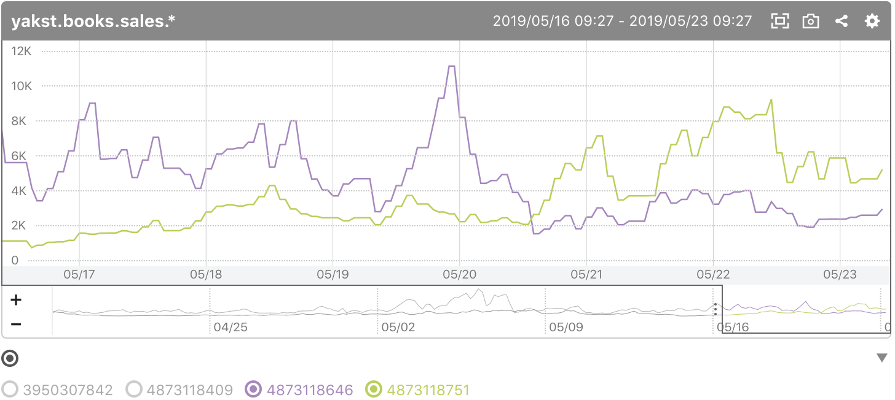

# mackerel-amazon-ranking

Amazonに掲載されている商品のランキングを取得して、Mackerelのサービスメトリクスとして投稿

Post Amazon ranking data as Mackerel service metrics



Usage in English is at the bottom of this page.

## 使用方法

1. 以下のアカウントを事前に作成
    - ランキングデータを取得したい国のAmazonアソシエイトアカウント (e.g. [日本](https://affiliate.amazon.co.jp/))と、Product Advertising APIの利用登録
    - [Mackerel](https://mackerel.io/)

2. リポジトリをクローン

    ```
    git clone git@github.com:doublemarket/mackerel-amazon-ranking.git
    ```

3. `config.yaml.sample`を`config.yaml` にリネームまたはコピー

    ```
    mv config.yaml.sample config.yaml
    ```

4. `config.yaml`を更新。`amazon_region`は[使用しているライブラリのコード](https://github.com/ngs/go-amazon-product-advertising-api/blob/61566202d7a2a0e9cd8b36c4208b6f96b72ccf2b/amazon/region.go#L6-L31)を参照して入力してください。`asins`には[ISBNコードではなくASIN](https://www.amazon.co.jp/gp/help/customer/display.html?nodeId=201889580)を入れてください。

    ```
    amazon_region: "REPLACE-WITH-YOURS"
    amazon_access_key: "REPLACE-WITH-YOURS"
    amazon_access_secret: "REPLACE-WITH-YOURS"
    amazon_account: "REPLACE-WITH-YOURS"
    mackerel_key: "REPLACE-WITH-YOURS"
    metric_prefix: "replace.with.your.preferred.prefix"
    asins:
      - "3950307842" # SQLパフォーマンス詳解
      - "4873118409" # 入門Kubernetes
      - "4873118646" # 入門監視
      - "4873118751" # 分散システムデザインパターン
    ```

5. 必要なパッケージを取得

    ```
    go get github.com/mackerelio/mackerel-client-go
    go get github.com/ngs/go-amazon-product-advertising-api/amazon
    ```

6. プログラムを実行。Amazonのランキングデータは1時間おきに更新されるので、cronなどで1時間おきに動かすとよいでしょう。

    ```
    # ビルドして実行
    go build amazonrank.go
    ./amazonrank

    # そのまま実行
    go run amazonrank.go
    ```

## Usage

1. Make sure you have accounts for:
    - Amazon Associates in the country you want to get the ranking data (e.g. [US](https://affiliate-program.amazon.com/)).
    - [Mackerel](https://mackerel.io/) to post and show the ranking data.

2. Clone the repository:

    ```
    git clone git@github.com:doublemarket/mackerel-amazon-ranking.git
    ```

3. Rename or copy `config.yaml.sample` to `config.yaml`:

    ```
    mv config.yaml.sample config.yaml
    ```

4. Update `config.yaml`. `amazon_region` should be one of the [available region code](https://github.com/ngs/go-amazon-product-advertising-api/blob/61566202d7a2a0e9cd8b36c4208b6f96b72ccf2b/amazon/region.go#L6-L31). Note that the `asins` should have [ASINs, not ISBN codes](https://www.amazon.com/gp/seller/asin-upc-isbn-info.html).

    ```
    amazon_region: "REPLACE-WITH-YOURS"
    amazon_access_key: "REPLACE-WITH-YOURS"
    amazon_access_secret: "REPLACE-WITH-YOURS"
    amazon_account: "REPLACE-WITH-YOURS"
    mackerel_key: "REPLACE-WITH-YOURS"
    metric_prefix: "replace.with.your.preferred.prefix"
    asins:
      - "3950307842" # SQLパフォーマンス詳解
      - "4873118409" # 入門Kubernetes
      - "4873118646" # 入門監視
      - "4873118751" # 分散システムデザインパターン
    ```

5. Get required packages:

    ```
    go get github.com/mackerelio/mackerel-client-go
    go get github.com/ngs/go-amazon-product-advertising-api/amazon
    ```

6. Build or just run the code. Ranking data on Amazon should be updated every hour so you may want to run it once per hour with cron etc.

    ```
    # Build and run
    go build amazonrank.go
    ./amazonrank

    # Run
    go run amazonrank.go
    ```
